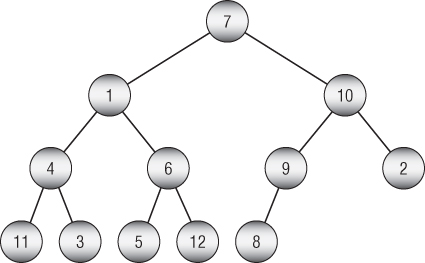
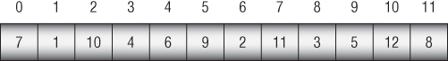
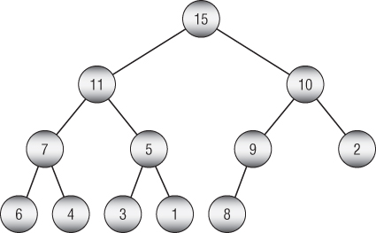
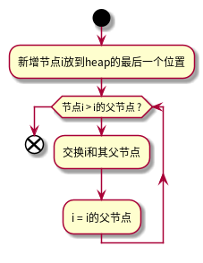
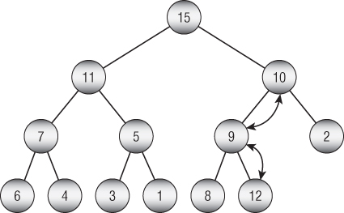
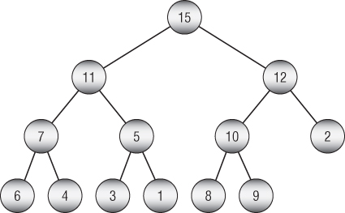
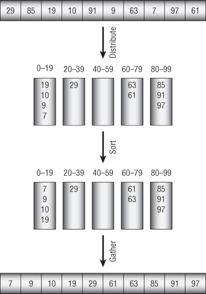
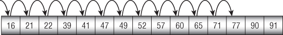
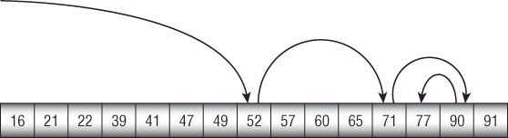
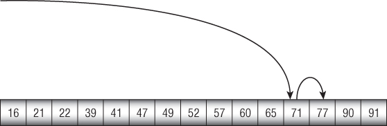

# Table of Contents

1.  [Sort](#org529c9b5)
    1.  [O(N2))](#orge851c8a)
        1.  [SelectSort](#org5e60333)
        2.  [InsertSort](#org22d5244)
        3.  [BubbleSort](#org3500aca)
    2.  [O(N\*log(N))](#org674806b)
        1.  [QuickSort](#orga521f14)
        2.  [MergeSort](#orge82677c)
        3.  [HeapSort](#orga29fc72)
    3.  [Sub O(N\*log(N))](#org82ebead)
        1.  [CountingSort](#org68c0d55)
        2.  [PIGEONHOLE SORT(鸽巢排序)](#org36cde65)
        3.  [BucketSort](#org1ae8e9d)
        4.  [RadixSort](#org81645c1)
2.  [Search](#org5d487c9)
    1.  [Linear Search](#org867f904)
    2.  [Binary Search](#orgfc6e675)
    3.  [Interpolation Search(插值搜索)](#org6508d8d)
    4.  [Majority Voting](#org54b0d76)

# Sort

## O(N2))

### SelectSort

### InsertSort

### BubbleSort

## O(N\*log(N))

### QuickSort

### MergeSort

### HeapSort

堆排序使用"堆"的数据结构, 在数组中排序 **完全二叉树**

排序完全二叉树

1.  完全二叉树的定义

    -   二叉树
    -   除了最底层之外的所有节点都有两个子节点
    -   所有节点都靠左排列
    
    
    
    使用数组表示完全二叉树,对于任意节点下表i,其子节点的序号分别是2\*i+1和2\*(i+1)
    
    对于任意节点j, 它的父节点下标是 &lfloor;(j-1)/2&rfloor; (&lfloor; x &rfloor; 表示floor(x), <=x的最接近整数)
    
    将上面的完全二叉树转换为数组存放, 其结果为:
    
    

2.  Heap(堆)的定义

    Heap是完全二叉树的一种特例-每个节点的值都大于等于它的子节点的值. 亦即对于任何一颗子树来说,它的根节点值都是该子树的最大值.
    
    将上面所示完全二叉树转换为堆结构为:
    
    

3.  堆的操作

    1.  新增节点
    
        对于每个新节点, 将其放置在合适的位置:
        
        
        
        在上述的Heap中新增节点12的示意如下:
        
        
        
        1.  12放到最后一个位置
        2.  12比其父节点9大, 交换12和9
        3.  交换后12比其父节点10大, 交换12和10;
        4.  12 <= 其父节点15, 新增过程结束
        
        
    
    2.  数组转换为堆
    
        数组转换为堆的过程描述如下:
        
              MakeHeap(Data: values[])
                // Add each item to the heap one at a time.
                For i = 0 To <length of values> - 1
            	// Start at the new item, and work up to the root.
            	Integer: index = i
            	While (index != 0)
            	    // Find the parent's index.
            	    Integer: parent = (index - 1) / 2
            
            	    // If child <= parent, we're done, so
            	    // break out of the While loop.
            	    If (values[index] <= values[parent]) Then Break
            
            	    // Swap the parent and child.
            	    Data: temp = values[index]
            	    values[index] = values[parent]
            	    values[parent] = temp
            
            	    // Move to the parent.
            	    index = parent
            	End While
                Next i
            End MakeHeap 
    
    3.  优先级队列的出队列操作
    
        堆亦可称之为优先级队列(priority queue), 上述新增节点的过程就是入队列的过程, 下面描述出队列的流程
        
        通过上面的描述可以知道, Heap的特性是root节点是最大节点, 所以队列只需要获取root元素的值即可.
        
        复杂一点的是移除了root元素之后, 剩余的两颗子树如何重构成一个Heap. 为了保证新的数是一颗完全平方树, 取其最后一个元素放到现有root的位置, 再从上到下的将其和两个子节点中较大的那个节点进行交换, 使其下沉到合适位置. 该过程和新增节点的操作道理相同, 顺序相反.
        
        出队列的伪代码描述如下:
        
            Data: RemoveTopItem (Data: values[], Integer: count)
                // Save the top item to return later.
                Data: result = values[0]
            
                // Move the last item to the root.
                values[0] = values[count - 1]
            
                // Restore the heap property.
                Integer: index = 0
                While (True)
            	// Find the child indices.
            	Integer: child1 = 2 * index + 1
            	Integer: child2 = 2 * index + 2
            
            	// If a child index is off the end of the tree,
            	// use the parent's index.
            	If (child1 >= count) Then child1 = index
            	If (child2 >= count) Then child2 = index
            
            	// If the heap property is satisfied,
            	// we're done, so break out of the While loop.
            	If ((values[index] >= values[child1]) And
            	    (values[index] >= values[child2])) Then Break
            
            	// Get the index of the child with the larger value.
            	Integer: swap_child
            	If (values[child1] > values[child2]) Then
            	    swap_child = child1
            	Else
            	    swap_child = child2
            
            	// Swap with the larger child.
            	Data: temp = values[index]
            	values[index] = values[swap_child]
            	values[swap_child] = temp
            
            	// Move to the child node.
            	index = swap_child
                End While
            
                // Return the value we removed from the root.
                return result
            End RemoveTopItem 

4.  HeapSort的实现

    明白优先级队列的入队列和出队列操作后, 我们可以很好的理解堆排序的具体流程:
    
    1.  使用数据构造出优先级队列
    2.  不断出队列,直至队列为0
    
    该过程使用伪代码描述如下:
    
        Heapsort(Data: values)
            <Turn the array into a heap.>
        
            For i = <length of values> - 1 To 0 Step -1
        	// Swap the root item and the last item.
        	Data: temp = values[0]
        	values[0] = values[i]
        	values[i] = temp
        
        	<Consider the item in position i to be removed from the heap,
        	 so the heap now holds i - 1 items. Push the new root value
        	 down into the heap to restore the heap property.>
            Next i
        End Heapsort 

5.  复杂度分析

    1.  空间复杂度
    
        假设输入N个数据, 则HeapSort算法使用大小为N的数组进行数据处理, 因此空间复杂度为O(N).
    
    2.  时间复杂度
    
        分为两个阶段来考虑:
        
        1.  使用输入数据构造Heap
            对于任意节点, 首先将其放到当前Heap的最后位置, 再向上提升, 提升的最大层数为log2(N);所以N个节点整个构造时间复杂度为N\*log(N)
        
        2.  出队列
            每次出队列, 相当于讲最后元素放到root位置, 在向下沉淀, 下降的最大层数为log2(N); 所以N个节点出队列的时间复杂度为N\*log(N)
        
        因此, HeapSort的时间复杂度为N\*log(N) + N\*log(N); 亦即N\*log(N)

## Sub O(N\*log(N))

对于N个元素的比较排序, 算法的时间复杂度不可能小于N\*log(N), 但是非比较排序则可能低于这个量级.

### CountingSort

对于要排序的元素其分布在一个较小的区间中时, 可使用CountingSort. 因为只是对于数字的排序, 所以没有多大的使用价值.

其思想是: 先建议一个以Value为索引的数组, 遍历数据, 将对应的Value数组做+1操作; 再遍历Value数组, 将值写回到原来数组.

    Countingsort(Integer: values[], Integer: max_value)
        // Make an array to hold the counts.
        Integer: counts[0 To max_value]
    
        // Initialize the array to hold the counts.
        // (This is not necessary in all programming languages.)
        For i = 0 To max_value
    	counts[i] = 0
        Next i
    
        // Count the items with each value.
        For i = 0 To <length of values> - 1
    	// Add 1 to the count for this value.
    	counts[values[i]] = counts[values[i]] + 1
        Next i
    
        // Copy the values back into the array.
        Integer: index = 0
        For i = 0 To max_value
    	// Copy the value i into the array counts[i] times.
    	For j = 1 To counts[i]
    	    values[index] = i
    	    index = index + 1
    	Next j
        Next i
    End Countingsort 

时间复杂度为O(2\*N + M) = O(N), 远低于O(N\*log(N)).

### PIGEONHOLE SORT(鸽巢排序)

使用Value的数量进行索引, 然后挂链表; 与CountingSort的区别:

1.  可以保存对象
2.  减小空间

    PigeonholeSort(Integer: values[], Integer: max)
        // Make the pigeonholes.
        Cell: pigeonholes[] = new Cell[max + 1]
    
        // Initialize the linked lists.
        // O(M)
        For i = 0 To max
    	pigeonholes[i] = null
        Next i
    
        // Move items into the pigeonholes.
        // O(N)
        For Each value in values
    	// Add this item to its pigeonhole.
    	Cell: cell = new Cell(value)
    	cell.Next = pigeonholes[value]
    	pigeonholes[value] = cell
        Next value
    
        // Copy the items back into the values array.
        Integer: index = 0
        // O(M+N)
        For i = 0 To max
    	// Copy the items in pigeonhole i into the values array.
    	Cell: cell = pigeonholes[i]
    	While (cell != null)
    	    values[index] = cell.Value
    	    index++
    	    cell = cell.Next
    	End While
        Next i
    End PigeonholeSort 

时间复杂度: O(N)

### BucketSort

    Bucketsort(Data: values[])
        <Make buckets.>
        <Distribute the items into the buckets.>
        <Sort the buckets.>
        <Gather the bucket values back into the original array.>
    End Bucketsort 

Bucketsort moves items into buckets, sorts the buckets, and then concatenates the buckets to get the sorted result.

桶排序的关键点在于桶的数量, 如果我们假设桶的数量(M)正比于要排序的元素个数(N), 那么每个桶里面分布的元素个数(N/M)是大致固定的.

再假设每个桶中N/M排序所需运算次数为F(N/M), 则该值为以常量值, 则总共的排序时间复杂度为:

O(N) + O(M\*F(N/M)) + O(N) = O(N+M) = O(N)

注意: 桶的数目M不能过小, 否则失去桶排序的意义.

### RadixSort

Radix sort takes in a list of n integers which are in base b (the radix) and so each number has at most d digits where d = &lfloor;(logb(k) +1)&rfloor; and k is the largest number in the list. For example, three digits are needed to represent decimal 104 (in base 10). It is important that radix sort can work with any base since the running time of the algorithm, O(d(n+b)), depends on the base it uses.

# Search

## Linear Search

## Binary Search

## Interpolation Search(插值搜索)

1000个100以内的数字,搜索77的示例.

    Integer: InterpolationSearch(Data values[], Data target)
        Integer: min = 0
        Integer: max = values.Length - 1
        While (min <= max)
    	// Find the dividing item.
    	Integer: mid = min + (max - min) *
    	    (target - values[min]) / (values[max] - values[min])
    
    	If (values[mid] == target) Then Return mid
    
    	<Set min or max to search the left or right half.>
        End While
    
        Return -1
    End InterpolationSearch 

## Majority Voting

假设投票中有一个选项会超过投票数的一半

怎么获取超过一半的这个选项???

    Outcome: BoyerMooreVote(List<Outcome> outcomes)
        Outcome: majority = ""
        Integer: counter = 0
        For Each outcome In outcomes
    	If (counter == 0) Then
    	    majority = outcome
    	    counter = 1
    	Else If (outcome == majority) Then
    	    counter++
    	Else
    	    counter--
    	End If
        Next outcome
    
        Return majority
    End BoyerMooreVote 

