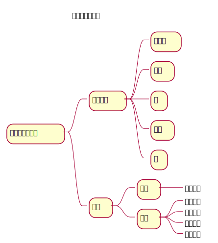

# Table of Contents

1.  [数据结构和算法](#orge548bf8)
    1.  [课程安排](#org2b76efb)
    2.  [学习路线](#org37fdd6a)
    3.  [学习方法](#orgd87ed63)

# 数据结构和算法

## 课程安排

<table border="2" cellspacing="0" cellpadding="6" rules="groups" frame="hsides">

<colgroup>
<col  class="org-left" />

<col  class="org-right" />
</colgroup>
<thead>
<tr>
<th scope="col" class="org-left">课程内容</th>
<th scope="col" class="org-right">学时</th>
</tr>
</thead>

<tbody>
<tr>
<td class="org-left">顺序表</td>
<td class="org-right">1</td>
</tr>

<tr>
<td class="org-left">链表</td>
<td class="org-right">3</td>
</tr>

<tr>
<td class="org-left">循环链表</td>
<td class="org-right">1</td>
</tr>

<tr>
<td class="org-left">栈</td>
<td class="org-right">1</td>
</tr>

<tr>
<td class="org-left">队列</td>
<td class="org-right">1</td>
</tr>

<tr>
<td class="org-left">树</td>
<td class="org-right">4</td>
</tr>

<tr>
<td class="org-left">排序算法</td>
<td class="org-right">4</td>
</tr>

<tr>
<td class="org-left">二分搜索算法</td>
<td class="org-right">1</td>
</tr>
</tbody>

<tbody>
<tr>
<td class="org-left">合计</td>
<td class="org-right">16</td>
</tr>
</tbody>
</table>

## 学习路线

## 学习方法

-   思想优先于编码
-   模仿优先于创新

